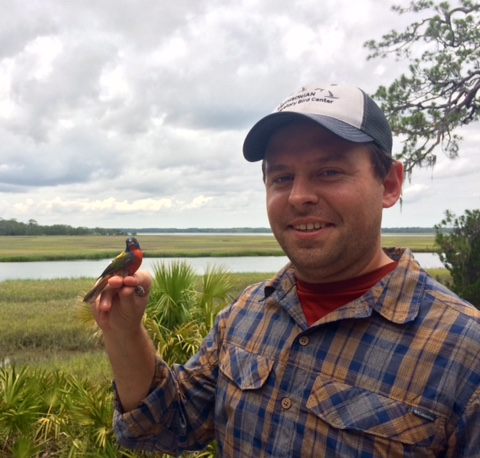

  

I am a quantitative ecologist with a focus on the ecology and conservation of migratory birds. Currently, I am a postdoctoral fellow with the US Geological Survey at the Patuxent Wildlife Research Center. Previous to this position, I held the George Didden and [James Smithson] postdoctoral fellowships at the [Smithsonian Migratory Bird Center]. 

My research generally focuses on three major themes: 1) How do processes operating across the entire annual cycle interact to limit populations? 2) How do limiting factors vary across spatial scales and species’ ranges? and 3) How can basic ecological research improve conservation outcomes? To address these questions, my research spans multiple scales of organization, from individuals to populations to species, and combines observational and experimental fieldwork with quantitative modeling and stable isotope analysis. In addition, I am committed to using my research program to influence the practice of biodiversity conservation through multi-disciplinary and collaborative partnerships.

This website is a work in progress but in the coming weeks and months I plan to add more information about my research, future plans, and current happenings. In the meantime, feel free to explore my [cv] and [github] or [contact] me with any questions. 

[Smithsonian Migratory Bird Center]: http://nationalzoo.si.edu/scbi/migratorybirds/
[Conservation Biology Institute]: https://nationalzoo.si.edu/scbi/
[github]: https://github.com/crushing05
[James Smithson]: http://www.smithsonianofi.com/fellowship-opportunities/james-smithson-fellowship-program/
[dissertation]: http://drum.lib.umd.edu/handle/1903/15377
[Behavior, Ecology, Evolution, and Systematics]: http://www.bisi.umd.edu/bees/
[contact]: http://crushing05.github.io/contact.html
[cv]: http://crushing05.github.io/cv.html
