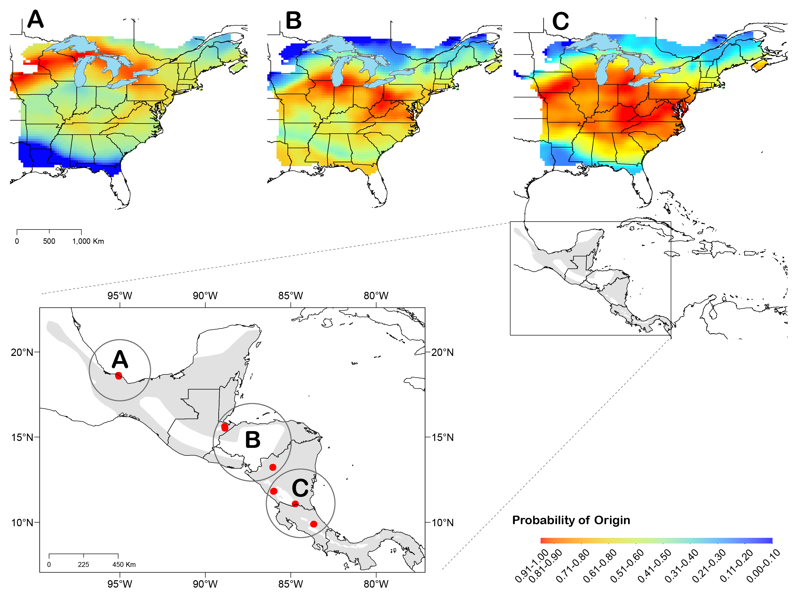
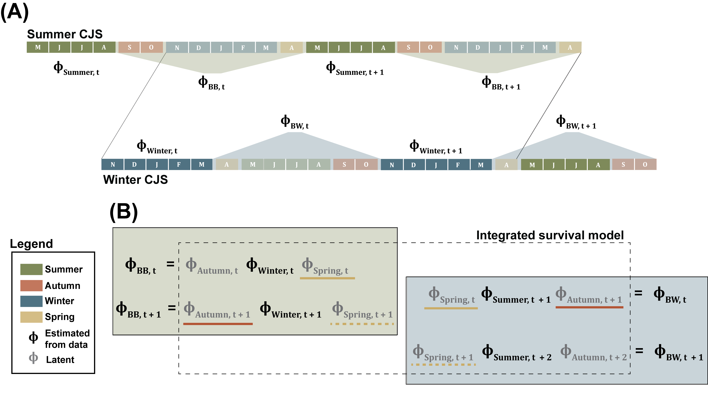
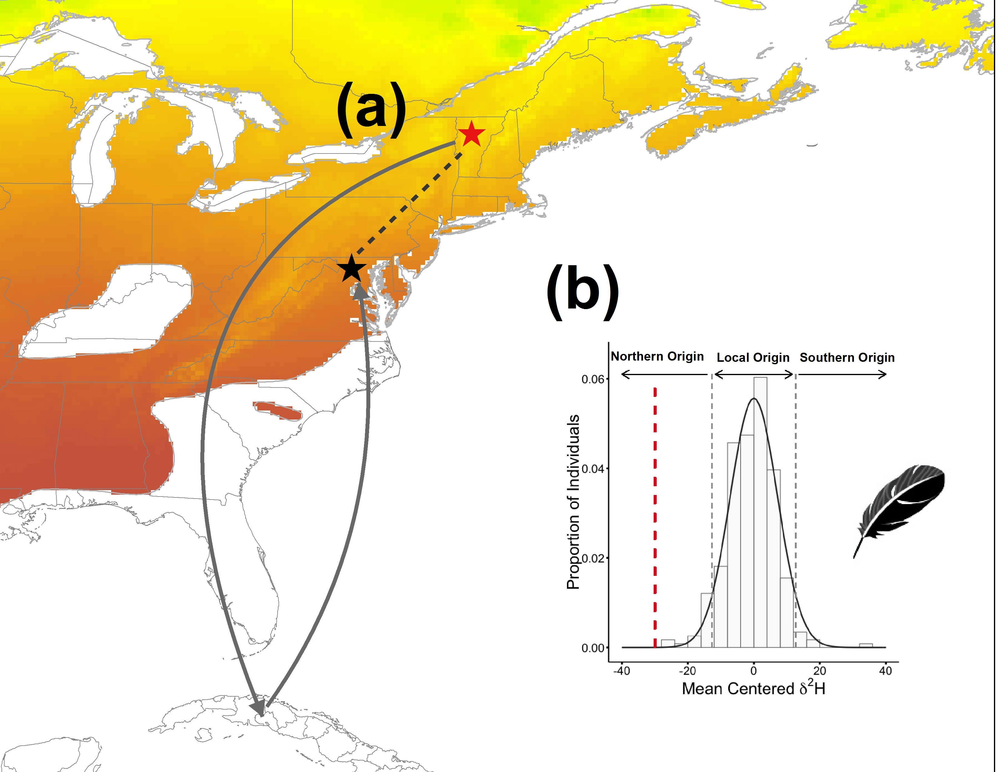

I am a population ecologist with an emphasis on quantifying demographic processes and their influences on individuals, populations, and species. My research focuses primarily on the ecology and conservation of animal migration, with projects falling within three major themes: 1) Development of full-annual-cycle models to quantify seasonal vital rates and their influence on population dynamics; 2) Demographic consequences of climate change and incorporating climate change into on conservation planning for migratory birds; and 3) Quantifying the influence of long-distance dispersal on individuals and populations. To address these issues, my research combines observational and experimental fieldwork with quantitative modeling and stable isotope analysis.  

Below are brief descriptions of past, current, and future research within each of these themes:  

**Development of full-annual-cycle models to quantify seasonal vital rates and their influence on population dynamics**  

Historically, efforts to identify limiting factors for migratory species have been hindered by the scale of annual migration movements, missing information about the geographic linkages between breeding and non-breeding populations (i.e., migratory connectivity), and the lack of analytical methods for linking population dynamics to demographic processes operating across the entire annual cycle. A major theme of my research is developing and parameterizing **full-annual-cycle** population models to overcome these challenges.  

   

Much of my research on full-annual-cycle models has focused on a declining migratory bird, the [Wood Thrush] (*Hylocichla mustelina*). Like many migratory birds, Wood Thrush populations have suffered large population declines in recent decades but the environmental and demographic drivers of these declines remain poorly understood. Spatial variation in migratory connectivity ([Rushing et al., 2014]; [Rushing et al., 2017a]) and the rate of decline ([Rushing et al., 2015a]) suggest that regional populations may experience distinct threats during the breeding and non-breeding periods. To quantify the contribution of full-annual-cycle environmental processes to regional population declines, colleagues and I developed a hierarchical model to link annual variation in breeding abundance to forest loss and climate change on the breeding and winter grounds ([Rushing et al., 2016a]). Results from this analysis suggested that regional populations in the core of the breeding range are likely limited by winter habitat but also that the steepest regional declines have likely been driven by breeding habitat loss. In contrast, abundance in populations at the periphery of the range was more strongly influenced by winter climate. Collectively, these results indicate that limiting factors are not uniform across space and suggest that a one-size-fits-all approach to management may not be effective.      

  

Ultimately, understanding populations dynamics and devising effective management strategies requires identifing the seasonal demographic processes that limit population growth. To address that issue, I developed a full-annual-cycle integrated population model (IPM) to link changes in breeding abundance to reproduction, immigration and seasonal survival. By integrating summer and winter capture-recapture data collected from linked populations, this model is able to parse annual survival into its seasonal components (summer, autumn, winter, and spring). Furthermore, by combining data on population size, survival, and reproduction, this model provides a full accounting of the demographic contributions to population dynamics. Application of the model to our Wood Thrush system provided the first separate estimates of spring and fall migration survival for a migratory songbird ([Rushing et al. 2017b]) and demonstrated that survival during spring migration is the largest demographic driver of population dynamics in this system.   

Currently, I am working on a number of projects that use and expand these full-annual-cycle frameworks to answer questions about the ecology and conservation of migratory birds. These projects include: using simulated data to investigate the estimability of latent migration survival rates from integrated capture-recapture models; identifying the environmental drivers of migration survival in several migratory wood warblers; quantifying the effects of winter density-dependence on spring migration survival and population limitation of American Redstarts (*Setophaga ruticilla*); and identifying potential limiting factors for [Rusty Blackbirds] (*Euphagus carolinus*), the fastest declining songbird in North America.  

Recently I have started a project with colleagues from the Smithsonian and Cornell focused on the southeastern [Painted Bunting] (*Passerina ciris*). The first phase of this project, initiated in summer 2017, involved deployment of light-level geolocators to quantify the winter distribution and migratory connectivity of this population. Future work will harness several large citizen-science programs to collect demographic monitoring data from linked summer and winter populations and develop a full-annual-cycle model to identify management actions to address recent populations declines.   

**Demographic consequences of climate change and impacts on conservation decisions for migratory birds**   

Predicting the impacts of climate change on plant and animal species requires understanding how demographic processes are influenced by abiotic conditions. Linking population-level responses to underlying demographic processes provides researchers with a mechanistic basis for predicting future consequences of climate change and incorporating this information into conservation planning. In my current position at the Patuxent Wildlife Research Center, I am developing quantitative methods to measure the impacts of climate change on the distributions of North American birds and to incorporate this information into conservation decisions made by federal agencies.  
 

My research on climate change impacts uses data from the [North American Breeding Bird Survey] to create indices of climate-induced range shifts. This approach uses dynamic occupancy models to estimate occupancy, extinction, and colonization rates for individual species, taking into account both non-equilibrium dynamics and imperfect detection. Output from these models provide estimates of the velocity, magnitude, and direction of range shifts that have occurred in recent decades. Results from individual species can then be combined in composite metrics, which allow stronger inferences about climate change impacts and can be used to test hypotheses about the traits that may influence sensitivity to climate change.  
 

Many federal agencies are tasked with protecting North America’s avian diversity and these agencies must make sound decisions about when and where to invest resources to achieve their legal mandates. Climate change adds a major source of uncertainty to these decisions because the places that are important for conservation now may differ from the critical locations in the future. Along with colleagues from USGS and USFWS, I am working to incorporate predicted effects of climate change (and associated uncertainty) into decision-support frameworks for migratory bird conservation. Initially, these efforts are focused on incorporating climate change into USFWS land acquisition decisions. Stay tuned for more!  

**Long-distance dispersal and the scale of source-sink dynamics**  

  
Immigration and emigration (collectively termed dispersal) are two of the primary processes that determine population dynamics. The consequences of these movements are poorly understood due to the logistical challenges associated with tracking dispersing in the field. A major theme of my research has been developing novel tracking and analytical tools to study the individual- and population-level consequences of long-distance dispersal.  

I use observational and experimental fieldwork, stable isotope analysis, and statistical modeling to study the causes and consequences of long-distance dispersal in migratory songbirds. My work on American Redstarts produced a number of novel insights, including: 1) climatic conditions during breeding and winter periods drive long-distance dispersal ([Rushing et al., 2015b]); 2) reproductive success is influenced by winter habitat quality but not long-distance dispersal ([Rushing et al., 2016b]); and 3) philopatric and dispersing individuals use different cues to select breeding territories ([Rushing et al., 2015c]).  

Currently, my research on dispersal is aimed at understanding the intersection between habitat selection, dispersal distance, and population dynamics. By combining demographic data and stable isotope data within an integrated population model, it is possible to distinguish between local vs. long-distance immigration. By comparing the rate and scale of Wood Thrush immigration across breeding patches that differ in size/quality, we hope to understand how habitat selection criteria vary across age and dispersal distance and how these individual decisions affect population dynamics. Future work on this subject will focus on experimental and theoretical validation of these findings and their implication for wildlife management.

[Rushing et al., 2014]: papers/Rushing_et_al-2014-Ecological_Applications.pdf
[Rushing et al., 2015a]: papers/Rushing_et_al-Journal_of_Applied_Ecology.pdf
[Rushing et al., 2015b]: papers/Rushing_et_al-2015-Ecography.pdf
[Rushing et al., 2015c]: papers/Rushing_et_al-2015-Journal_of_Animal_Ecology.pdf
[Rushing et al., 2016a]: papers/Rushing_et_al_2016_PRBS.pdf
[Rushing et al., 2016b]: papers/Rushing_et_al-2016-Ecology.pdf
[Rushing et al., 2017a]: papers/Rushing_et_al-2017-Ecology_and_Evolution.pdf
[Rushing et al., 2017b]: papers/Rushing_et_al-2017-Ecology.pdf

[Rusty Blackbirds]: http://rustyblackbird.org/
[Wood Thrush]:https://www.facebook.com/iwothca
[North American Breeding Bird Survey]: https://www.mbr-pwrc.usgs.gov/bbs/bbs.html
[Painted Bunting]: https://www.allaboutbirds.org/guide/Painted_Bunting/id